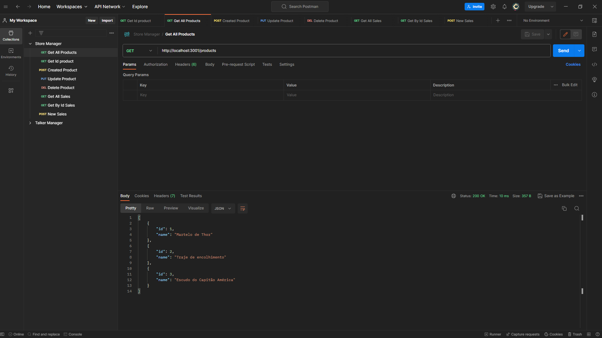

# Store Manager



# Índice

* [Título e Imagens Home](#store-manager)
* [tecnologias utilizadas](#tecnologias-utilizadas)
* [Descrição do projeto](#descrição-do-projeto)
* [Status do Projeto](#status-do-projeto)
* [Funcionalidade do projeto](#🔨-funcionalidade-do-projeto)
* [Acesso ao Projeto](#acesso-ao-projeto)
* [Rotas](#rotas)

# Tecnologias utilizadas


# Descrição do Projeto

O projeto "Store Manager" é parte do currículo da formação de Desenvolvedor Web da [Trybe](https://www.betrybe.com/). Nesse projeto, os alunos têm a oportunidade de aplicar seus conhecimentos com a Linguagem JavaScript para criar um servidor Rest Full e tests com a Biblioteca Chai. 

# Status do Projeto

> 💹 Alpha 💹

# 🔨 Funcionalidade do projeto

- Lista Todos os Produtos
- Exibir o Produto pelo Id
- Criar um novo Produto
- Atualizar o Produto
- Apagar o Produto
- Lista Todas As Vendas
- Lista as Vendas por Id
- Criar Nova venda

# Acesso ao projeto

Para acessar e executar este projeto, siga os passos abaixo:

1. Certifique-se de ter o Node.js, npm e Docker instalados em sua máquina.

2. Clone o Projeto

```bash
git clone https://github.com/EversonDias/API_Rest_Full_Store_Manager_with_JavaScript_Express_Docker_MySQL.git StoreManager
```

3. Entre no projeto

```bash
cd StoreManager
```

4. Instale as Dependências

```bash
npm install
```

5. inicie o projeto

```bash
docker-compose up -d
```

# Rotas

<details>
<summary><strong>Get All Products</strong></summary>

method ```GET```

Rota

```bash
http://localhost:3001/products
```

</details>

<details>
<summary><strong>Get By Id Products</strong></summary>

method ```GET```

Rota

```bash
http://localhost:3001/products/1
```

</details>

<details>
<summary><strong>Created Product</strong></summary>

method ```POST```

Rota

```bash
http://localhost:3001/products
```

corpo da requisição
```json
{
    "name": "Luva do Thanos"
}
```
</details>

<details>
<summary><strong>Update Product</strong></summary>

method ```PUT```

Rota

```bash
http://localhost:3001/products/4
```

corpo da requisição
```json
{
    "name": "Luva do Thanos sem as Joias"
}
```
</details>

<details>
<summary><strong>Delete Product</strong></summary>

method ```DELETE```

Rota

```bash
http://localhost:3001/products/4
```

</details>

<details>
<summary><strong>Get All Sales</strong></summary>

method ```GET```

Rota

```bash
http://localhost:3001/sales
```

</details>

<details>
<summary><strong>Get By Id Sales</strong></summary>

method ```GET```

Rota

```bash
http://localhost:3001/sales/1
```

</details>

<details>
<summary><strong>New Sales</strong></summary>

method ```POST```

Rota

```bash
http://localhost:3001/sales
```

corpo da requisição
```json
[
    {
        "productId": 3,
        "quantity": 1
    }
]
```
</details>
